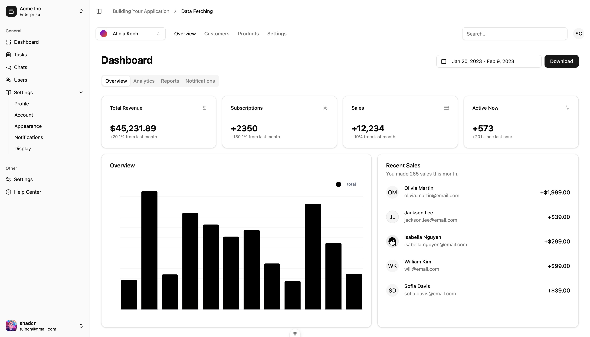

# Shadcn Admin Vue Dashboard

这是一个基于[ShadcnUI](https://www.shadcn-vue.com/) 示例和[shadcn-admin](https://github.com/satnaing/shadcn-admin) 和TailwindCSS的Vue3管理后台模板。

> 大概两三周看到shadcn-admin的代码，就想自己实现一个，于是就有了这个项目。
> 这个项目是我自己的学习过程，可能会有很多问题，欢迎大家提出问题和建议。

## 功能

- 登录页面
- 主页
- 表格
- 表单
- 图表
- 表单(注册)完善中...
- 颜色切换完善中...



## Recommended IDE Setup

[VSCode](https://code.visualstudio.com/) + [Volar](https://marketplace.visualstudio.com/items?itemName=Vue.volar) (and disable Vetur).

## Type Support for `.vue` Imports in TS

TypeScript cannot handle type information for `.vue` imports by default, so we replace the `tsc` CLI with `vue-tsc` for type checking. In editors, we need [Volar](https://marketplace.visualstudio.com/items?itemName=Vue.volar) to make the TypeScript language service aware of `.vue` types.

## Customize configuration

icons：https://lucide.dev/icons/
components：https://www.shadcn-vue.com/
preview：https://shadcn-admin-vue.netlify.app/

## Project Setup

```sh
pnpm install
```

### Compile and Hot-Reload for Development

```sh
pnpm dev
```

### Type-Check, Compile and Minify for Production

```sh
pnpm build
```

### Run Unit Tests with [Vitest](https://vitest.dev/)

```sh
pnpm test:unit
```

### Lint with [ESLint](https://eslint.org/)

```sh
pnpm lint
```
